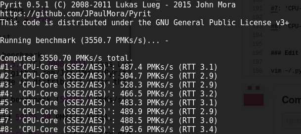
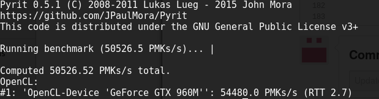

# Kali-rolling with cuda 8 and OpenCl/CPyrit

### I have used the latest weekly build here:

cdimage.kali.org/kali-images/kali-weekly/

### I created the bootable of this iso

kali-linux-2017-W06-amd64.iso

Interestingly after the primary install, originally, I was able to boot into the GUI after the reboot but on testing this process again I had the classic screen freeze after login. To get round this I used CTRL + ALT + F2 to get the tty and carried on the process.

### Then the usual lets get it all updated and start the funsies.

apt update && apt -y upgrade && apt -y dist-upgrade

### reboot

apt install -y linux-headers-$(uname -r)

### Bumblebeed Install

I tried to test this again and ran into issues that were not present previously. I could not get the bumblebeed install to run so had to temp edit the grub boot config. On the end off the linux line add acpi=off and hit f10. I could then hit the gui and continue.

apt install -y bumblebee-nvidia

After this I was able to reboot into the GUI as normal.

### Virtualgl install

wget https://sourceforge.net/projects/virtualgl/files/2.5.1/virtualgl_2.5.1_amd64.deb

dpkg -i virtualgl_2.5.1_amd64.deb

### Grab the latest Cuda run file and export the perl path for the utils

I tried installing the latest version and ran into the following error:

./cuda_8.0.61_375.26_linux.run 

gzip: stdin: invalid compressed data--format violated

Extraction failed.

Ensure there is enough space in /tmp and that the installation package is not corrupt

Signal caught, cleaning up

So went back to the following:

wget https://developer.nvidia.com/compute/cuda/8.0/prod/local_installers/cuda_8.0.44_linux-run

mv cuda_8.0.44_linux-run cuda_8.0.44_linux.run

chmod +x cuda_8.0.44_linux.run

### InstallUtils.pm needs this as perl5 doesn't include the current directory on Debian

export PERL5LIB=.

### Cuda Install

./cuda_8.0.44_linux.run -override

accept the license

select yes for incompatible build 

no for drivers 

select defaults from there

### Install the Nvidia icd

apt install -y nvidia-opencl-icd

### Now install the cuda driver

./cuda_8.0.44_linux.run -silent -driver

### Post install paths

export PATH=/usr/local/cuda-8.0/bin${PATH:+:${PATH}}

export LD_LIBRARY_PATH=/usr/local/cuda-8.0/lib64\

export LD_LIBRARY_PATH=/usr/local/cuda-8.0/lib64\${LD_LIBRARY_PATH:+:${LD_LIBRARY_PATH}}

### Get the latest OpenCl

apt install -y nvidia-opencl-dev 

cd /root/NVIDIA_CUDA-8.0_Samples/1_Utilities/deviceQuery

make

./deviceQuery 

### Get the opencl tools

cd /
curl https://codeload.github.com/hpc12/tools/tar.gz/master | tar xvfz -

cd tools-master/

make

./print-devices 

You will see an error for device not found.

### Get rid of the clover device errors

vim /etc/OpenCL/vendors/mesa.icd 

comment out the .so file

./cl-demo 1000000 10

### Install clinfo

apt install -y clinfo

clinfo

### Further testing

cd /opt/VirtualGL/bin/

./glxspheres64

./glxinfo

glxinfo | grep -i "direct rendering"

### CPyrit install

As OpenCL is now installed a good addition is CPyrit

### Add dependancies

apt install -y libz-dev libssl-dev libpcap-dev

### Add pyrit from git

cd /
git clone https://github.com/JPaulMora/Pyrit.git

### Enter directory and build

Do this step as the CPyrit modules need to be installed to be able to build CPyrit_OpenCL, the standard pyrit with Kali does not have to modules.

cd Pyrit

python setup.py build

python setup.py install

### Enter OpenCL directory and build NOTE# cpyrit_cuda wont build unless you use gcc 5, latest kali is version 6

cd modules/cpyrit_opencl/

python setup.py build

python setup.py install

### Benchmark before CPyrit enabled

### Edit the config to disable CPU and enable OpenCL

vim ~/.pyrit/config

set:

limit_ncpus = -1

use_OpenCL = true

### Benchmark after CPyrit enabled

