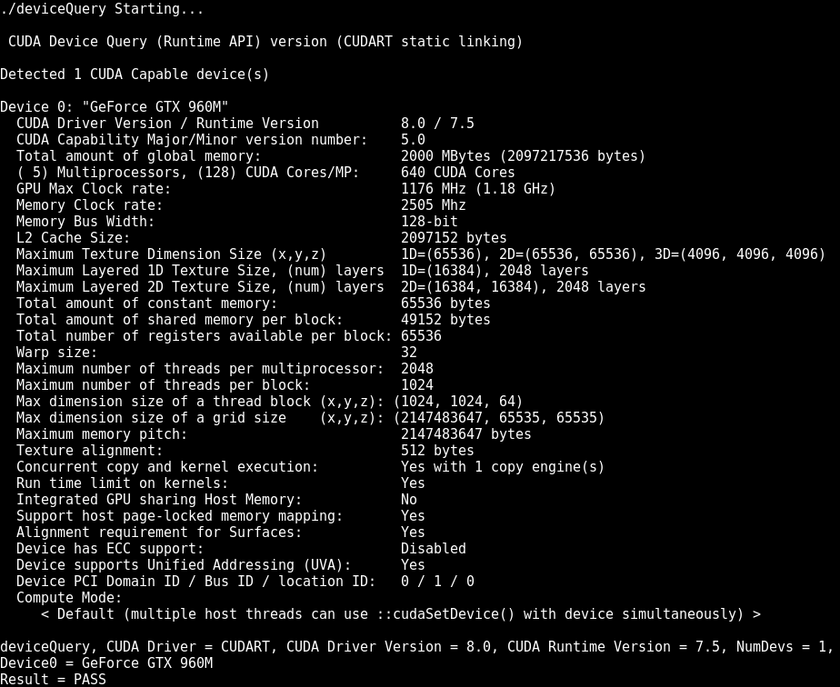

# kali-rolling-nvidia-cuda

Tested working on kernels 4.8 through 4.9

I have put this together after much pain of finding a good install path for my GTX960m and to use nvidia card with full cuda support. I have read many, many postings around this and work arounds that were in some cases not good solutions like disabling acpi! Some where far to bloated but all in some way aided me in the final setup of this which I hope helps some people.

### I have used the latest weekly build here:

cdimage.kali.org/kali-images/kali-weekly/

### I created the bootable of this iso

kali-linux-2017-W06-amd64.iso

### Then the usual lets get it all updated and start the funsies.

apt update && apt -y upgrade && apt -y dist-upgrade

apt install -y linux-headers-$(uname -r)

apt install bumblebee-nvidia

service bumblebeed start

wget https://sourceforge.net/projects/virtualgl/files/2.5.1/virtualgl_2.5.1_amd64.deb

dpkg -i virtualgl_2.5.1_amd64.deb 

cd /opt/VirtualGL/bin/

./glxspheres64 

./glxinfo 

glxinfo | grep -i "direct rendering"

apt install libxi libxi6 libxi-dev libglu1-mesa libglu1-mesa-dev libxmu6 freeglut3-dev libxmu-dev libpcap-dev

wget http://developer.download.nvidia.com/compute/cuda/7.5/Prod/local_installers/cuda_7.5.18_linux.run

export PERL5LIB=.

./cuda_7.5.18_linux.run --override

select yes for unsupported configuration, no for the driver install and then choose defaults for the rest.

Now lets see if it worked!

cd /root/NVIDIA_CUDA-7.5_Samples/1_Utilities/deviceQuery

make 

optirun ./deviceQuery

Woot!

If you fancy a bit of old school cudahashcat

https://hashcat.net/files_legacy/cudaHashcat-2.01.7z

OpenCL now working with Cuda [Guide here](Opencl.md)
